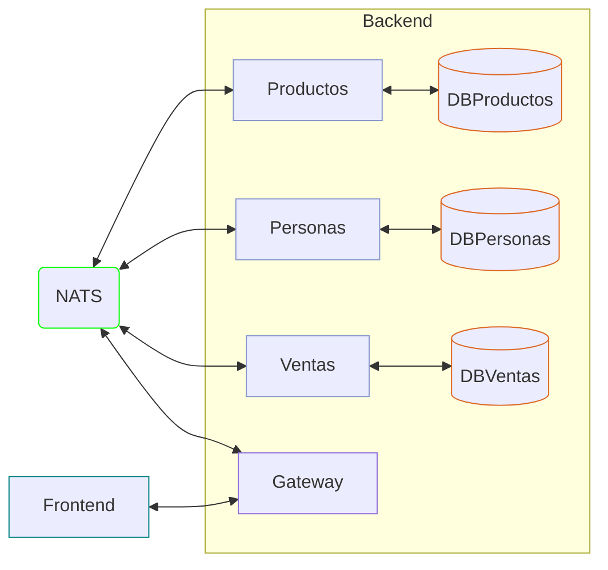

# Tienda 211 - Fastify

## Run

```sh
# Requiere NATS server
docker run -p 4222:4222 -ti nats:latest

# en cada carpeta de microservicio
npm run dev
```

- Basado en [akobashikawa/tienda401-fastify: Ejercicio de implementar una tienda. Fastify con BDD. Arquitectura hexagonal. Microservicios con Gateway y NATS.](https://github.com/akobashikawa/tienda401-fastify)

- Es una versión con microservicios comunicándose a través de NATS
- Cada microservicio tiene su propia tabla independiente
- El frontend invoca a un gateway y el gateway se comunica con los microservicios a través de NATS
- Un service puede invocar a otros services también por HTTP



## Servicios

- **Gateway Service**
    - PORT: 3000

```sh
cd backend/gateway-service
npm install
npm test
npm run dev
```

- **Productos Service**
    - PORT: 3001

```sh
cd backend/productos-service
npm install
npm test
npm run dev
```

- **Personas Service**
    - PORT: 3002

```sh
cd backend/personas-service
npm install
npm test
npm run dev
```

- **Ventas Service**
    - PORT: 3003

```sh
cd backend/ventas-service
npm install
npm test
npm run dev
```

## Frontend

- Cada service tiene un frontend
- Para facilitar la prueba, el frontend del gateway es igual que el frontend general

## TODO

- Revisar validaciones. Parece que se estuvieran duplicando.
- Revisar arquitectura. La parte donde el controlador se vuelve NATS.
